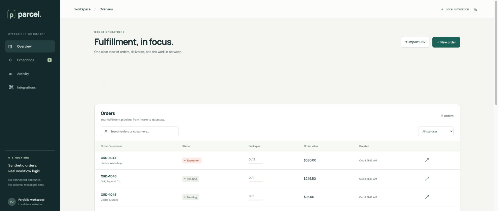

# Parcel — Order Operations & Fulfillment Automation

A runnable, local-first portfolio demo for order intake, multi-package fulfillment, and operational exception handling.

**Simulation by default; connected mode available.** Customers and tracking events remain synthetic. Connected mode dispatches actions to Zapier and waits for authenticated execution receipts. The protected Railway deployment passed automatic ClickUp task creation/completion, Slack notifications, authenticated receipts and scheduled digest catch-up/restart checks. See [connected setup](doc/connected-setup.md).

## Run

Requires **Node.js 24+** and npm.

```sh
npm ci
npm run dev
```

Open **http://127.0.0.1:4300/**. The API runs at port 4310. Four synthetic orders are seeded automatically and local data persists in `workspace/orders.sqlite` (ignored by Git).

For the built app:

```sh
npm run build
npm start
```

Open **http://127.0.0.1:4310/**. Stop the development API before starting the built app on the same port. Run a single server per database. `.env.example` documents optional settings; the server reads environment variables, not `.env` automatically.

```sh
PORT=4312 DATABASE_PATH=workspace/separate-demo.sqlite npm start
```

## What works



- Form intake and CSV import with row-level validation, quoted-field parsing, multi-package grouping, and duplicate-order protection.
- Shipment events with event-ID deduplication, timestamp ordering, and protection against delivered-state regression.
- Partial versus complete delivery across multiple packages.
- Persistent action outbox with bounded retries, failed-action exceptions, and operator-controlled replay.
- Order search/filter, details, synthetic tracking-event controls, execution history, and an on-demand daily digest.
- A one-click reliability playground for duplicate events, older updates, temporary failures, and permanent failures.

## Two-minute walkthrough

1. **Overview → ORD-1042**: inspect the two packages and simulated fulfillment task.
2. Click **Complete a delivery** once: the order becomes partially delivered. Click again: both packages are delivered.
3. Click **Repeat an event** and **Send an older update**: inspect the ignored-event messages and unchanged delivered status.
4. Click **Recover a timeout**: Activity shows retrying, then succeeded after the scheduled retry, with two attempts.
5. Click **Trigger an exception**: Exceptions shows a failed connection. **Repair & replay (demo)** removes the injected fault and reuses the action ID. The worker resolves the exception on success.
6. Paste [fixtures/orders.csv](fixtures/orders.csv) into **Import CSV**: two valid orders import; the invalid email is reported. Repeat the import to see duplicate detection.
7. Open an imported order and use **Simulate tracking update** to send a synthetic event for any package.

Synthetic event injection verifies local business logic. It is not evidence of a real carrier event or working external Zap.

## Validation

```sh
npm test
npm run build
npm audit
```

Tests cover validation, CSV grouping, deduplication, ordering, multi-package status, exception recovery, retry exhaustion, transaction rollback, database reopen, and HTTP responses. See [verification notes](doc/verification.md) for current results.

## Architecture

React + TypeScript + Vite frontend; Fastify + Zod API; Node's built-in SQLite module; Vitest for deterministic tests. The SQLite outbox is the local automation engine. The provider simulator records stable action IDs. Connected mode adds a Zapier bridge with per-order sequencing, verified task IDs, authenticated receipts, and explicit handling of uncertain external outcomes.

See [architecture/API](doc/architecture.md) and [English case study](doc/case-study.md).

This is a single-user demonstration. Public binding requires an access password; connected mode also requires HTTPS callbacks and a persistent database. The protected Railway instance runs connected mode. Automatic ClickUp creation, two-package fulfillment updates, Slack notifications and scheduled digest receipts passed. Startup catch-up and restart deduplication passed; enable optional scheduling with DAILY_DIGEST_TIME and DAILY_DIGEST_TIME_ZONE. The user opened the hosted UI on a phone. Hosted desktop access and a fresh two-package connected acceptance passed after user login. Repeatable video generation uses offline UI replay plus dated connected evidence. Zapier premium features currently use a trial ending2026-10-22; no paid Zapier plan was purchased.

## Regenerate the portfolio video

Install authoring dependencies with `npm ci --prefix media`, then run `npm run video`. This generates the two-minute MP4, captions, preview and input/output hash manifest in ignored `workspace/video/`. UI and rules are reused directly from the application; rendering sends no SaaS actions. See [video pipeline](doc/video-pipeline.md).

## Repository scope

This repository contains product code, tests, synthetic fixtures, runtime documentation, and demonstration assets. Career plans and selection research remain in the sibling `upwork-workflow` repository. This is a personal demo project, not a paid client case study; no revenue or time-saving claims are made.
