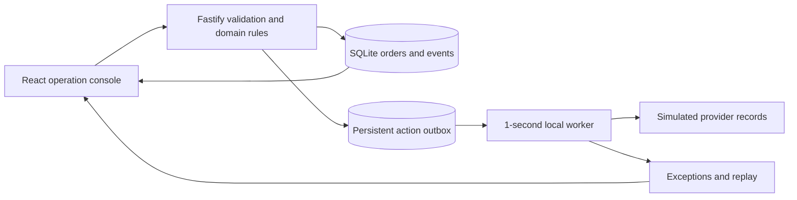

# Architecture and API

Local-first portfolio demo. All customer data is synthetic. Mode is `simulation`; integration steps write to a local outbox and simulated external records, never to real accounts. Node 24+ is required for node:sqlite. React/TypeScript/Vite UI, Fastify API, Zod validation, SQLite durability. API listens on 127.0.0.1:4310; Vite proxies /api to it.

## Data

Order: id, customer, email, total (USD), createdAt, status (`pending`, `in_transit`, `partially_delivered`, `delivered`, `exception`), shipments [{id,orderId,carrier,trackingNumber,status (`pending`,`in_transit`,`delivered`,`exception`),lastEventAt}], taskId (nullable).
Exception: id, orderId nullable, kind, message, status (`open`,`resolved`), createdAt, actionId nullable.
Action: id, orderId, type (`create_task`,`update_task`,`notify`,`daily_digest`), status (`pending`,`retrying`,`succeeded`,`failed`), attempts, maxAttempts, nextAttemptAt nullable, lastError nullable, createdAt, completedAt nullable, payload object.
Event log: id, orderId nullable, type, message, createdAt.

## API contract

All endpoints return JSON. Error {error:string,details?:unknown}.
- GET /api/overview -> {mode:'simulation',metrics:{orders,active,delivered,exceptions,successRate},orders:Order[],exceptions:Exception[],actions:Action[],logs:EventLog[],integrations:[{name,status:'simulated',description}]}
- GET /api/orders/:id -> {order,logs,actions}
- POST /api/orders {id,customer,email,total,shipments:[{carrier,trackingNumber}]} -> {order,duplicate:boolean}; duplicate same canonical payload ignored, conflicting ID returns 409. One or more shipments required.
- POST /api/import {csv:string} -> {imported,duplicates,errors:[{row,message}]}; header order_id,customer,email,total,carrier,tracking_number. Multiple rows of same order are grouped into shipments. CSV supports quoted fields. Invalid orders don't import partially.
- POST /api/events {id,trackingNumber,carrier,status:'in_transit'|'delivered'|'exception',occurredAt:ISO datetime} -> {accepted:boolean,reason?:string,order?:Order}; dedup event ID, carrier+tracking match, ignore older/equal timestamps and terminal delivered regressions. Unknown shipment returns 404.
- POST /api/demo/seed {} -> {added:number}; idempotent synthetic fixture bootstrap.
- POST /api/demo/scenario {scenario:'delivery'|'duplicate'|'retry'|'permanent_failure'|'out_of_order'} -> {message:string}; explicit demo helper; selects seeded order as needed. Duplicate/late event scenarios require existing delivered demo shipment (server ensures this). Retry scenario enqueues a simulated timeout then retry; permanent failure produces failed action requiring resolve/replay.
- POST /api/actions/process {} -> {processed:number}; runs eligible queue items, worker also runs automatically.
- POST /api/actions/:id/replay {} -> {action}; failed actions only. Reset attempts and retry the same ID, resolve associated action exception after success.
- POST /api/digest {} -> {action}; simulated daily digest on demand (no actual timed external sends).

## Reliability

SQLite transactions atomically persist order/event changes and outbox actions. Event IDs and carrier/tracking pairs are unique. Timestamps and status transitions prevent state regression. Outbox retries transient failures with capped exponential delay; permanent failures create actionable exceptions. Simulated provider records deduplicate by action ID. A real provider integration must reconcile ambiguous network timeouts; no exactly-once claim across real services.

## First version boundary

No live Zapier/ClickUp/Slack/AfterShip credentials, no actual carrier tracking, no cloud deployment, no AI dependency. UI must label simulation. Local app is not a public multi-user service; authentication and public webhook signature verification are prerequisites before exposure.

## Implemented components

`server/engine.ts` implements transactions, import, event processing and the worker; `server/app.ts` exposes the API; `server/index.ts` seeds fixtures and runs the worker, serving the built UI when dist exists. `client/App.tsx` includes synthetic event controls for any order. The simulator is not a real Zapier execution engine.
